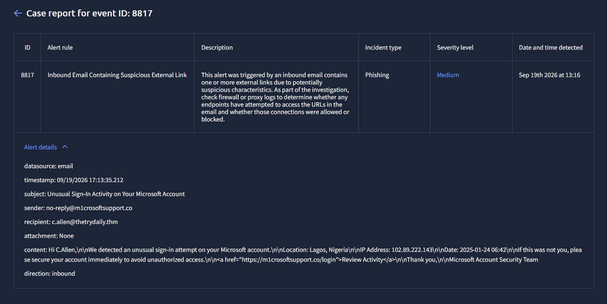

# Case 01 – Phishing Email Analysis

## Time of Activity
Sep 19th 2026 – 13:17 - 13:20

---

## Alert Information

- Event ID: 8817  
- Alert Rule: Inbound Email Containing Suspicious External Link  
- Severity: Medium  
- Incident Type: Phishing  

---

## Alert Details

## Affected Entities

- User: c.allen@thetrydaily.thm  
- Sender: no-reply@m1crosoftsupport.co  
- Malicious Domain: m1crosoftsupport.co  
- Direction: Inbound  

---

## Incident

An alert was triggered for a suspicious inbound email containing an external link with potential phishing characteristics. The message attempts to impersonate Microsoft and lure the user into clicking a malicious login link.

---

## Investigation

The analysis focused on the email content, sender reputation and embedded link.

Key observations:
- The sender domain (m1crosoftsupport.co) is a spoofed version of a legitimate Microsoft domain  
- The domain uses character substitution (1 instead of i), a common phishing technique  
- The email subject indicates urgency: "Unusual Sign-In Activity"  
- The message attempts to create panic and force immediate action  
- The link directs the user to a fake login page  

---

## Findings

- Spoofed domain identified  
- Social engineering technique detected (urgency + impersonation)  
- Malicious link included in the email body  
- No evidence of user interaction with the link  

---

## Classification

True Positive

---

## Reason for Classification

The alert was triggered by a phishing email containing:

- A spoofed domain mimicking Microsoft  
- A malicious external link  
- Social engineering tactics to trick the user  

These indicators confirm that the email is a phishing attempt.

---

## Recommendations

- Block the domain m1crosoftsupport.co  
- Add the sender to email blacklist policies  
- Educate users about phishing attempts  
- Monitor for similar emails targeting other users  
- Ensure email security filters are properly configured  

---

## Conclusion

The investigation confirmed a phishing attempt targeting an internal user. The attack relied on domain spoofing and social engineering techniques. No compromise was identified during the analysis.

---

## Disclaimer

This analysis was conducted in a controlled lab environment for educational purposes on TryHackMe. All activities were performed in accordance with ethical guidelines and did not involve any real-world systems or users.
