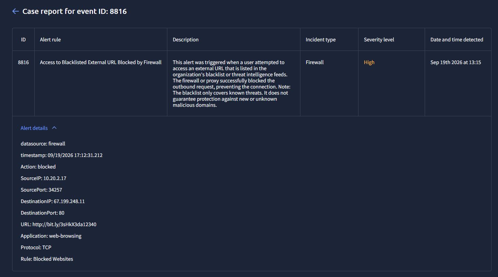

# Case 02 - Blacklisted URL Access

## Alert Overview

An alert was triggered when an internal host attempted to access an external URL listed in the organization's blacklist. The security control (firewall) successfully blocked the request, preventing the connection.

## Alert Information

- Event ID: 8816  
- Alert Rule: Access to Blacklisted External URL Blocked by Firewall  
- Severity: High  
- Date: Sep 19th 2026 13:15  
- Data Source: Firewall  

## Alert Visualization

## Affected Entities

- Source IP: 10.20.2.17  
- Destination IP: 67.199.248.11  
- URL: http://bit.ly/3sHkX3da12340  
- Application: Web Browsing  
- Protocol: TCP  

## Investigation

The investigation was conducted using a SIEM simulator, focusing on the analysis of network activity and user behavior associated with the alert.

The identified URL uses a URL shortening service (bit.ly), which is commonly leveraged to obscure malicious destinations. Threat intelligence indicates that the destination is associated with known malicious activity.

Further analysis revealed that the user performed a prior web search related to payroll configuration. This behavior suggests that the access attempt was likely initiated through user interaction, such as clicking on a malicious or misleading search result.

Firewall logs confirm that the outbound connection attempt was blocked and no communication with the external host was established.

No evidence of payload delivery, execution or endpoint compromise was identified during the investigation.

## Conclusion

The firewall effectively mitigated the threat by blocking access to a known malicious URL.

Although no compromise occurred, the event indicates that the user was exposed to a potentially malicious link, likely through search engine interaction. This highlights the risk of phishing or malicious redirection through legitimate browsing activity.

## Recommendations

- Provide user awareness regarding risks associated with shortened URLs and unknown links  
- Reinforce training on phishing and malicious search results  
- Monitor the source host (10.20.2.17) for any additional suspicious behavior  
- Ensure endpoint protection solutions are active and updated  

## Indicators of Compromise (IOCs)

- URL: http://bit.ly/3sHkX3da12340  
- Destination IP: 67.199.248.11  
- URL shortening service usage (bit.ly)  
- Firewall rule triggered: Blocked Sites  

## Disclaimer

This analysis was conducted in a controlled lab environment for educational purposes using TryHackMe. No real systems were impacted.
