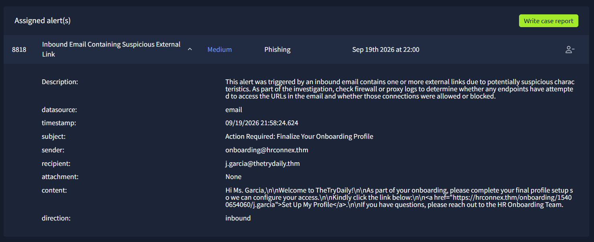
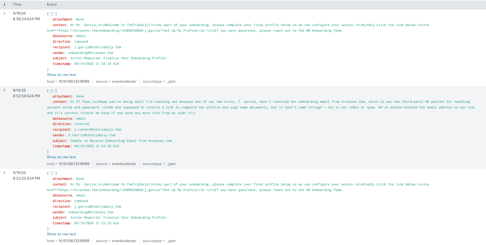

# Case 03 – Phishing Email Analysis (HR Onboarding Attack)

## Alert Overview

A phishing attempt was identified targeting a newly onboarded user through a malicious HR onboarding pretext. The attacker impersonated an HR process and attempted to lure the user into accessing an external domain.

The attack involved multiple email deliveries within a short time frame and included an internal email referencing the same domain, suggesting a potential pretexting strategy.

---

## Incident Information

- Event ID: 8818
- Alert Type: Inbound Email Containing Suspicious External Link
- Severity: Medium
- Category: Phishing
- Date: September 19, 2026
- Time Window: 21:52:25 – 21:58:24
- Data Source: Email Logs (Splunk)

---

## Affected Entities

- Target User: j.garcia@thetrydaily.thm
- External Sender: onboarding@hrconnex.thm
- Suspicious Domain: hrconnex.thm
- Internal User (under review): h.harris@thetrydaily.thm

---

## Attack Description

The attack leveraged a social engineering technique based on an HR onboarding scenario, instructing the user to complete a setup process through an external link:

https://hrconnex.thm/onboarding/15400654060/j.garcia

Key indicators:

- Use of a non-corporate domain impersonating HR services
- Personalized URL containing the target username
- Urgency-driven messaging ("Action Required")
- Link-based phishing with no attachments

---

## Timeline

- 21:52:25 – First phishing email delivered
- 21:53:58 – Internal email referencing hrconnex.thm
- 21:58:24 – Second phishing email delivered

---

## Investigation

The investigation was conducted using Splunk, focusing on email logs and domain activity correlation.

### Email Analysis

The email exhibited classic phishing indicators:

- Social engineering using onboarding scenario
- Direct call-to-action
- External domain masquerading as internal service
- Personalization to increase credibility

### Domain Analysis

The domain "hrconnex.thm" was analyzed within Splunk:

- Only 3 related events identified
- No historical presence in logs
- No evidence of legitimate organizational use

This strongly indicates the domain is malicious or unauthorized.

### User Activity Analysis

- No DNS queries for the domain
- No HTTP/HTTPS requests observed
- No endpoint interaction detected

This confirms that the user did not access the malicious link.

### Behavioral Indicators

- Repeated email delivery within a short time frame
- Targeted attack (single user)
- Use of contextual information (new employee onboarding)

---

### Conclusion

The phishing attempt was unsuccessful and resulted in no compromise.

---

## Classification

- Threat Type: Spear Phishing
- Incident Classification: True Positive

---

## Indicators of Compromise (IOCs)

- Domain: hrconnex.thm
- Sender: onboarding@hrconnex.thm
- URL: https://hrconnex.thm/onboarding/15400654060/j.garcia
- Subject: Action Required: Finalize Your Onboarding Profile

---

## Recommendations

### Immediate Actions

- Block domain hrconnex.thm across security controls
- Flag sender as malicious

### User Awareness

- Notify the targeted user
- Reinforce phishing awareness training

### Security Operations

- Monitor for similar phishing campaigns
- Investigate internal email legitimacy
- Search for similar indicators across logs

### Long-Term Improvements

- Improve email filtering for domain impersonation
- Enhance phishing detection capabilities
- Conduct regular security awareness training

---

## Disclaimer

This analysis was conducted in a controlled lab environment for educational purposes using TryHackMe and Splunk.
