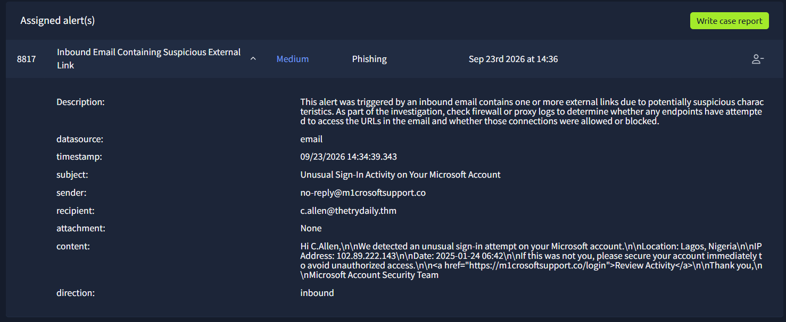
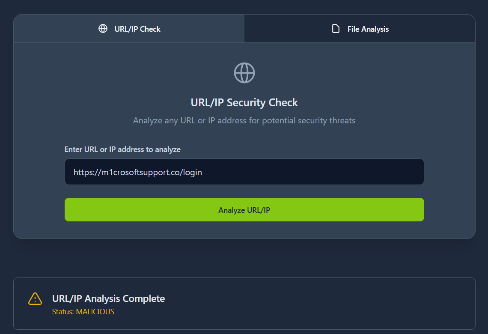
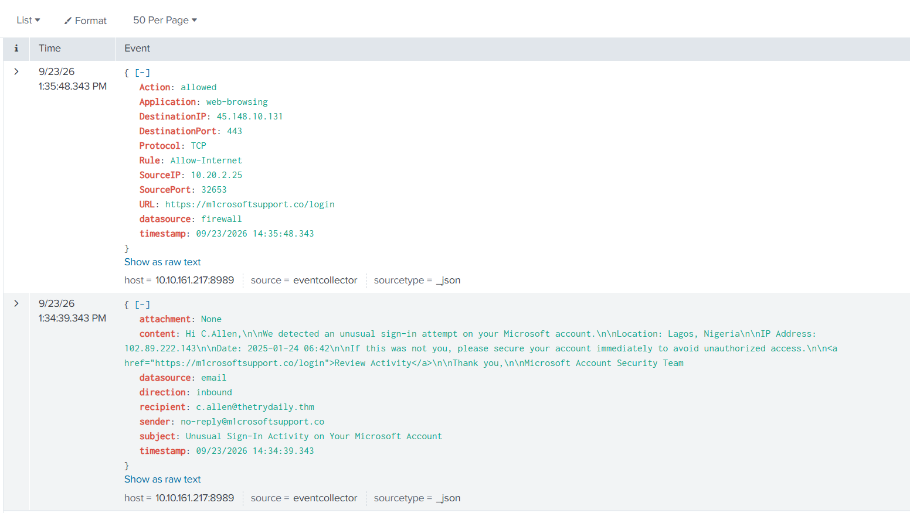

### Phishing Investigation Lab

This lab documents the investigation of a phishing email that led to a successful user interaction with a malicious link. The analysis includes email inspection, URL validation and firewall log correlation.

### Scenario
An inbound email was received claiming unusual Microsoft account activity. The message urged the user to take immediate action by clicking a link. The investigation confirmed that the user accessed the malicious URL, making this a potential security incident.

### Alert Details
- Alert Type: Phishing
- Severity: Medium
- Data Source: Email, Firewall
- Status: True Positive

### Key Indicators
- Suspicious sender domain: `m1crosoftsupport.co`
- Lookalike domain: typosquatting
- Social engineering using urgency
- Malicious URL identified
- User clicked the link (confirmed in logs)

### Investigation Steps

#### 1. Email Analysis
- The sender domain mimics Microsoft but is not legitimate
- Message creates urgency with a security warning
- Personalized greeting increases credibility
- Contains a malicious external link

#### 2. URL Analysis
- The URL was analyzed and classified as malicious
- Domain is not associated with Microsoft
- Likely phishing page designed to steal credentials

#### 3. Log Correlation (Splunk)
- Firewall logs confirm outbound connection
- Connection was allowed - not blocked
- Traffic details:
  - Protocol: TCP
  - Port: 443 (HTTPS)
  - Action: allowed
  - Source IP: 10.20.2.25

This confirms user interaction with the malicious link.

### Impact
- Potential credential compromise
- Possible account takeover risk
- Requires further investigation

### Recommended Actions
- Reset user credentials immediately
- Check for suspicious login activity
- Block malicious domain across the network
- Educate user about phishing awareness
- Monitor for lateral movement or further compromise

This lab was completed as part of the TryHackMe platform, simulating real-world SOC alert investigation scenarios.
